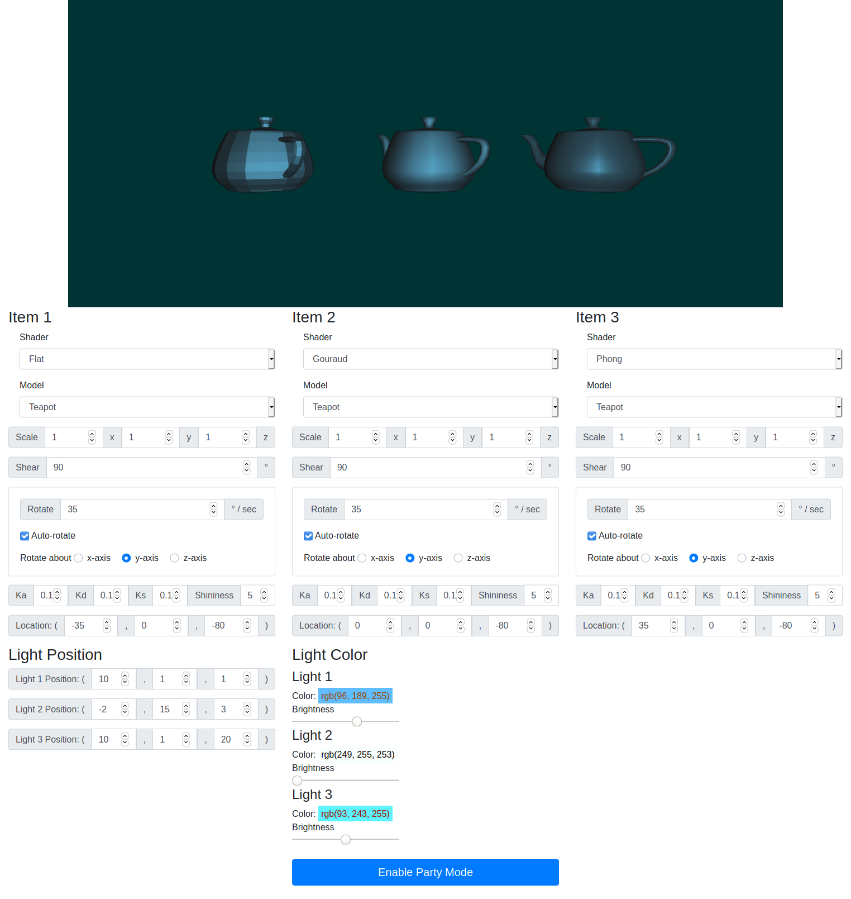

# NTU ICG HW1 (Multiple Shading and Transformation)
Homework 1 for Interactive Computer Graphics (2020 Spring), Dept. of Computer Science and Information Engineering, National Taiwan University.  
國立台灣大學資訊工程學系 計算機圖形（CSIE5085） ，歐陽明老師授課  

Implementation of the Flat shading, Gauraud shading, and Phong shading using WebGL.  

